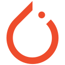

## Hi there 👋

My name is Tai Qi Zheng. I am a computer science student. This is my [Potfolio](https://qztai.github.io/Potfolio/)
 
<a href="./resume.pdf" target="_blank">📄 View My Resume</a>
<h2> 🚀 &nbsp;Some Tools I Have Used and Learning</h2>

  
  
  
  
  
  
  
  <!---->

- 🔭 I’m currently working on ...
- 🌱 I’m currently learning ...
- 🤔 I’m looking for help with ...
- 💬 Ask me about ...
<!--
**QZTAI/QZTAI** is a ✨ _special_ ✨ repository because its `README.md` (this file) appears on your GitHub profile.

Here are some ideas to get you started:

- 🔭 I’m currently working on ...
- 🌱 I’m currently learning ...
- 👯 I’m looking to collaborate on ...
- 🤔 I’m looking for help with ...
- 💬 Ask me about ...
- 📫 How to reach me: ...
- 😄 Pronouns: ...
- ⚡ Fun fact: ...
-->
